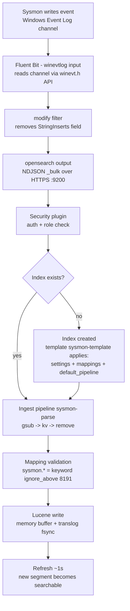

# Ingestion architecture — from Sysmon event to queryable field

This document explains how endpoint telemetry travels from the Windows VM into OpenSearch,
and the design decisions behind the ingest pipeline, index template, and mappings.
It exists because two real failures during the build (a mapping conflict and an unqueryable
message blob) forced the design below - both are documented here as lessons.

## The problem this layer solves

Detections ask precise questions ("`Image` ends with `\mimikatz.exe`"). Precise questions
require the data to exist as **separate, typed fields**. Raw Windows/Sysmon events arrive
as one large text blob (`Message`) plus a few envelope fields - the interesting fields
(`Image`, `CommandLine`, `ParentImage`, `TargetImage`...) are trapped inside the blob and
are not queryable. This layer turns that blob into clean fields **once, at write time**
(schema-on-write), so every future query is cheap and exact.

## Data flow

## Component decisions

### Fluent Bit (shipper, on the VM)

- `winevtlog` input reads `Microsoft-Windows-Sysmon/Operational`.
- `modify` filter **removes `StringInserts`** before shipping. Reason: it is a
  mixed-type array (strings and numbers) that is a pure duplicate of the `Message`
  content. Mixed types break dynamic mapping (see incident 1).
- `opensearch` output: TLS on, `tls.verify off` (lab self-signed cert),
  `Suppress_Type_Name On` (required - legacy `_type` is rejected by OpenSearch),
  static index `sysmon-logs`.
- Debugging note: the opensearch output is **silent on success** and generic on failure
  ("failed to flush chunk"). `Trace_Error On` prints the actual per-item bulk response
  from OpenSearch - this is how incident 1 was diagnosed.

### Ingest pipeline `sysmon-parse` (server-side, write time)

Sysmon's `Message` is CRLF-separated `Key: Value` lines under a header line
("Process Create:"). Three processors:

| # | Processor | What it does | Why |
|---|-----------|--------------|-----|
| 1 | `gsub` | regex `^.*?\r?\n` -> `""` into `_msg_body` | Strips the header line. It contains no `": "` separator and made the kv processor throw (`does not contain value_split`). Lazy `.*?` = first line only. |
| 2 | `kv` | `field_split: [\r\n]+`, `value_split: ": "`, `target_field: sysmon` | Splits lines, then key from value on the **first colon-space**. Plain `:` would break on `C:\` paths and `05:33:05` timestamps - colon-space never appears inside values. `[\r\n]+` collapses stray blank lines. `ignore_failure: true` = a malformed message indexes unparsed instead of being rejected. |
| 3 | `remove` | drops `_msg_body` | No temp field stored. |

Validated with `POST _ingest/pipeline/sysmon-parse/_simulate` before deployment -
the simulate run is what caught the header-line failure at zero risk.

### Index template `sysmon-template` (pattern `sysmon-logs*`)

Templates apply **only at index creation** - changing a template never alters an
existing index (that requires delete/reindex).

- `number_of_replicas: 0` - a replica may never be allocated on the same node as its
  primary; on a single-node cluster the replica stays UNASSIGNED and health is yellow.
  Zero replicas = green. Production would keep replicas (>= 1) across nodes.
- `index.default_pipeline: sysmon-parse` - parsing is enforced by the server on every
  write. The shipper needs no knowledge of it and can be swapped without losing parsing.
- Dynamic template: every string under `sysmon.*` maps to
  `keyword` with `ignore_above: 8191`:
  - `keyword` = the whole value is indexed as one exact term (what Sigma-style
    exact/wildcard matching needs). `text` would tokenize and lowercase paths.
  - Default dynamic mapping caps keyword at **256 chars**: longer values are silently
    not indexed (the doc gets an `_ignored` marker; queries simply miss it). Encoded
    PowerShell command lines exceed 256 routinely - a detection blind spot.
  - **Why 8191**: Lucene's hard term limit is 32,766 bytes; UTF-8 worst case is
    4 bytes/char; 8191 x 4 = 32,764 <= 32,766. Largest safe character count.

## Incidents that shaped the design

### Incident 1 - dynamic mapping conflict (`StringInserts`)

Symptom: every bulk item rejected with
`mapper [StringInserts] cannot be changed from type [long] to [text]`; Fluent Bit
logged `failed to flush chunk` then `cannot be retried` (4xx = permanent, chunk dropped).

Root cause: no explicit mapping existed, so **dynamic mapping** typed the field from
the first value seen (a number -> `long`) and committed it to cluster state. Mappings
are immutable (Lucene segments encode each type in a different on-disk layout), so
every later document with string content was rejected.

Fix: remove the field at the shipper (redundant data) + delete the poisoned index so a
fresh mapping could form. Prevention: explicit mappings via the index template.

### Incident 2 - unqueryable message blob

Symptom: documents indexed fine, but `Image`/`CommandLine`/`ParentImage` did not exist
as fields - only inside the `Message` string. No field, no inverted index, no detection.

Fix: the `sysmon-parse` ingest pipeline (above). First kv attempt failed on the header
line - caught in `_simulate`, fixed with the `gsub` header strip.

## Storage model (why this design is fast)

Per field, Lucene builds an **inverted index**: a sorted term dictionary (FST -
shared prefixes stored once) mapping each term to a **postings list** of doc IDs
(delta-encoded, block-packed, with skip lists). A detection query is a term seek plus
a postings read - milliseconds regardless of event volume. This only works because
fields exist and are typed correctly, which is what the pipeline and template guarantee.

Operational notes:

- Events become searchable on **refresh** (default 1s), not on ack. The translog
  (fsynced before ack) guarantees durability across crashes.
- Leading-wildcard queries (`*\tool.exe`) cannot prefix-seek the FST and scan the term
  dictionary - fine at lab scale, a rule-performance consideration in production.
- Silent field drops are monitorable:
  `GET sysmon-logs/_search {"query":{"exists":{"field":"_ignored"}}}` returns every
  document where a value exceeded `ignore_above`. Worth alerting on in production.

## Lab simplifications vs production

| Lab choice | Production practice |
|------------|--------------------|
| `tls.verify off` (self-signed demo cert) | Real CA-signed certs, verification on |
| `replicas: 0` (single node) | >= 1 replica across nodes |
| admin superuser for shipping | Dedicated low-privilege ingest user/role |
| Static index `sysmon-logs` | Data stream or ISM-managed rollover indices |
| Password in local shipper config | Secrets store / env injection |
